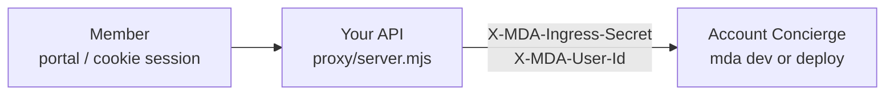

# Account Concierge

A **member-facing Account Concierge** that lives behind *your* existing product
API — the same session / SSO layer that already protects your app.

Members never talk to LangSmith directly. Your backend authenticates them,
proxies agent traffic, and stamps who they are. The concierge greets them by
account and keeps every thread private to that user.

1. The member is already signed into your product (here: a toy `/login?user=` cookie)
2. Your API (the proxy) forwards LangGraph calls and stamps reserved headers
3. The concierge’s `whoami` tool reads the identity MDA resolved for that run

`MDA_INGRESS_SECRET` stays server-side only. Contrast with
[`policy-desk/`](../policy-desk) (Policy Desk), where the browser presents a
Supabase JWT directly.

## How it works



`identity.ts` uses the default:

```ts
export const identity = defineIdentity(); // auth: "backend"
```

In production this proxy is any Nest/Express/FastAPI BFF or gateway that already
owns login. Swap the toy cookie for Okta, Auth0, your session store — MDA only
needs the stamped user id.

## Layout

```text
account-concierge/
  agent.ts           # defineDeepAgent + whoami tool
  identity.ts        # defineIdentity() — trusted backend
  instructions.md
  tools/whoami.ts    # returns runtime.identity
  proxy/server.mjs   # toy session + header-stamping proxy
  env.example
```

## Configure

```bash
cd account-concierge
npm install
cp env.example .env
# set OPENAI_API_KEY and MDA_INGRESS_SECRET (LANGSMITH_API_KEY only for deploy)
```

Generate any strong random string for `MDA_INGRESS_SECRET` and use the **same**
value for `mda dev` / deploy and for the proxy.

## Run locally

```bash
npm run dev
```

That starts two processes in parallel:

- MDA / LangGraph on `http://localhost:2024` (`dev:agent`; often IPv6 `::1`)
- the product-API proxy on `http://127.0.0.1:4910` (`dev:proxy`)

Then sign in as a member and ask the concierge **through the proxy**:

```bash
# 1. Establish a session as alice (stand-in for your real login)
curl -c cookies.txt 'http://127.0.0.1:4910/login?user=alice'

# 2. Create a thread (proxied → MDA with ingress headers)
THREAD=$(curl -s -b cookies.txt -X POST 'http://127.0.0.1:4910/threads' \
  -H 'content-type: application/json' -d '{}')
echo "$THREAD"

# 3. Ask the concierge who is signed in (assistant id = agent name)
THREAD_ID=$(node -e "console.log(JSON.parse(process.argv[1]).thread_id)" "$THREAD")
curl -s -b cookies.txt -X POST \
  "http://127.0.0.1:4910/threads/${THREAD_ID}/runs/wait" \
  -H 'content-type: application/json' \
  -d '{
    "assistant_id": "account-concierge",
    "input": { "messages": [{ "role": "user", "content": "Hi — which account am I signed in as?" }] }
  }' | jq -r '.messages[-1].content'
```

You should see the concierge answer as **alice**. Log in as `bob` and repeat —
threads stay scoped per member. A real deployment would add account-scoped tools
(plan lookup, invoices, support tickets); this example focuses on proving
identity reaches the agent.

### Raw headers (no proxy)

A real backend does the same stamp without the toy cookie layer:

```bash
curl -s -X POST 'http://localhost:2024/threads' \
  -H 'content-type: application/json' \
  -H "X-MDA-Ingress-Secret: $MDA_INGRESS_SECRET" \
  -H 'X-MDA-User-Id: alice' \
  -d '{}'
```

Never put `MDA_INGRESS_SECRET` in frontend code or client bundles.

## Deploy

```bash
npm run deploy
# or: Actions → Deploy agent → account-concierge
```

Point `LANGGRAPH_API_URL` in the proxy (or your production API) at the hosted
deployment URL. Keep `MDA_INGRESS_SECRET` as a deployment secret and only on
server-side config.

## What this demonstrates

- **Use case** — Account Concierge behind an existing authenticated product API
- **Trusted-backend identity** — default `defineIdentity()`
- **Custom backend proxy** — session auth + ingress header stamping
- **Per-user thread scoping** — different `X-MDA-User-Id` values cannot share threads
- **`runtime.identity` in tools** — `whoami` proves the member id reached the agent
